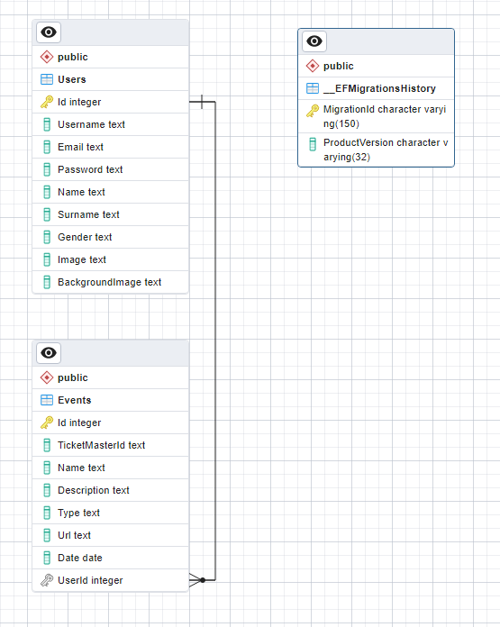

# MyTicket

## General information

MyTicket is a web app that let's the user viewing cultural events and observing them

## Used technologies
- React js
- Node.js v18.15.0.
- CSS
- PostgresSQL - ver. 15.1
- ASP.NET Core - ver. 7.0.5
- Entity Framework - ver. 7.0.5

## Features

- login
- register
- display events in catalog
- event subpage
- add event observation
- logout
- setting (change password, change data of user)

## Database Visualization

